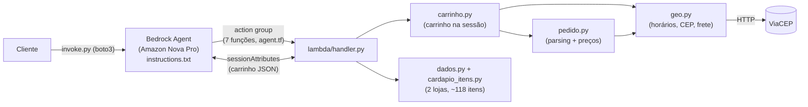

# Avaliação do repositório — 2026-07-11

**Pergunta avaliada:** este repo serve de base para um **atendente completo de padaria** com várias lojas (cada uma com horário e itens próprios), itens com peculiaridades, carrinho por conversa, etc.?

**Método:** revisão multi-agente em 5 dimensões (carrinho/preços, horários/geo, integração Bedrock, gaps de produto, infra/Terraform) mais um testador que **executou** os módulos Python. Cada finding passou por verificação adversarial independente: **44 confirmados, 0 refutados, 8 bugs provados por execução**. Dados brutos em [`revisao-2026-07-11.findings.json`](revisao-2026-07-11.findings.json).

## 1. Sumário executivo

A fundação arquitetural está **correta**: o carrinho vive na Lambda (via `sessionAttributes`), o motor de preços é determinístico, o formato pipe (`id|qtd|...`) contorna a fragilidade de tool use do Nova, e as funções recusam com motivo estruturado em vez de confiar no prompt. Esse desenho aguenta a evolução planejada.

Mas, como está, **não é um atendente completo — é um protótipo de conversa que não entrega pedido**:

- `finalizar_pedido` **não registra o pedido em lugar nenhum** — o número `PED-...` é um UUID cosmético; a loja nunca fica sabendo (crítico).
- O carrinho não permite **remover item nem mudar quantidade**, e evapora após **10 minutos** de silêncio (TTL da sessão).
- O modelo de dados **não generaliza para padaria**: variações de item (tamanho/borda/meio-a-meio) são hardcoded para pizza; cardápio, preços e lojas são código Python (mudar um preço exige redeploy + republicar o agente).
- Não existem: **busca de item por nome**, canal real (só um script de teste), pagamento, status de pedido, estoque/esgotado, área de entrega, testes.

Com o roadmap da seção 5, a base atual chega lá sem reescrita — os módulos têm interfaces limpas (`get_item`, `precificar`, `loja_aberta`) que permitem trocar a origem dos dados e generalizar o modelo de item sem tocar no resto.

## 2. Arquitetura atual

| Arquivo | Responsabilidade |
|---|---|
| `agent.tf` | Agente, action group e schema das 7 funções |
| `instructions.txt` | Prompt de sistema (~6,6 KB) |
| `iam.tf` / `lambda.tf` | Roles e empacotamento/publicação da Lambda |
| `lambda/handler.py` | Dispatch das funções + envelope de resposta do Bedrock |
| `lambda/dados.py` | Lojas, bordas, categorias, índice do cardápio |
| `lambda/cardapio_itens.py` | ~110 itens (gerado) |
| `lambda/pedido.py` | Parsing do formato pipe + motor de preços |
| `lambda/carrinho.py` | Carrinho em `sessionAttributes`, revisar/finalizar |
| `lambda/geo.py` | Horários, disponibilidade, ViaCEP, frete |
| `invoke.py` | Cliente de teste (o AWS CLI não suporta `InvokeAgent`) |

**Decisão de modelo:** Nova Pro (`us.amazon.nova-pro-v1:0`). Claude está bloqueado na conta (use case form não enviado); o Nova Lite corrompia o parâmetro `itens` — daí o formato pipe em vez de JSON aninhado.

## 3. Bugs confirmados

⚗️ = comportamento provado executando o código (não apenas leitura).

### Crítico

| Onde | Bug |
|---|---|
| `lambda/carrinho.py:186` | **`finalizar_pedido` não persiste nada.** Gera `PED-{uuid}`, devolve o JSON e apaga o carrinho — sem DynamoDB, fila ou sequer log estruturado. O cliente recebe "pedido confirmado" e a loja nunca fica sabendo; o número não existe em sistema algum. |

### Alto

| Onde | Bug |
|---|---|
| `lambda/carrinho.py:143` | **Sem remover item / alterar quantidade** — só `limpar_carrinho` (tudo-ou-nada). Retry do modelo duplica linha ⚗️; item que sai da janela de horário deixa o carrinho num beco sem saída: até `ver_carrinho` passa a falhar e a única saída é apagar tudo. |
| `lambda/pedido.py:29` | **Observações somem em silêncio** ⚗️. `hb01\|2\|sem picles` grava a obs no slot `tamanho` (nunca lido para não-pizza); obs com `\|` é truncada; obs com `;` quebra o parse inteiro. O "sem cebola" de uma restrição alimentar não chega à cozinha, sem erro. |
| `agent.tf:61` | O campo `obs` aparece na ordem do formato mas **não é documentado nem exemplificado** — para não-pizza o modelo teria que produzir `hb01\|1\|\|\|\|sem cebola` (4 campos vazios) sem nunca ter visto um exemplo. |
| `agent.tf:6` | `idle_session_ttl_in_seconds = 600`: **o carrinho evapora após 10 min de silêncio** — inviável no canal natural (WhatsApp), onde pausas longas são a norma. |
| `lambda/geo.py:80` | **ViaCEP fora do ar bloqueia 100% dos fechamentos** com a mensagem enganosa "CEP nao encontrado" (indistinguível de CEP errado) — e a validação nem é essencial, o frete é fixo por loja. |
| `lambda/geo.py:58` | **Sem área de entrega**: CEP de Manaus é aceito para entrega da loja da Paulista com frete de R$ 6. |

### Médio

| Onde | Bug |
|---|---|
| `lambda/geo.py:33` | **Janela que cruza a meia-noite nunca abre a loja** ⚗️ (`18:00–02:00` → `1080 <= atual <= 120`, impossível). O dado atual contorna com `23:59`, mas o texto promete "até 24h" (à 00:00 a loja já consta fechada ⚗️) e qualquer loja nova com fechamento de madrugada quebra em silêncio. |
| `lambda/handler.py:37` | `consultar_cardapio(loja=...)` calcula `disponivel_agora` olhando **todas** as lojas do item, não a filtrada: às 10h afirma que dá pra pedir bebida na pizzaria fechada; `adicionar_itens` depois recusa — contradição na conversa. |
| `lambda/carrinho.py:98` | **Loja forçada é ignorada em silêncio** quando o carrinho já tem itens ⚗️ (pede "da loja B", entra na A sem aviso). |
| `lambda/carrinho.py:117` | Mensagem de loja fechada afirma "**nenhuma loja aberta tem esse item**" mesmo quando é falso (item existe na outra loja, aberta) — perde a venda. |
| `lambda/carrinho.py:130` | `adicionar_itens` pode devolver **`sucesso=True` junto com `erro`** (item antigo ficou fora da janela): o modelo anuncia sucesso de um carrinho que não fecha mais. |
| `lambda/carrinho.py:192` | `finalizar_pedido` **não é idempotente**: 2ª chamada (retry comum do Nova) → "Carrinho vazio" ⚗️ — o modelo pode dizer que o pedido falhou logo após confirmá-lo. |
| `lambda/pedido.py:28` | **Quantidade não numérica vira 1 em silêncio** ⚗️ (`duas`, `2x`, `-2`, `1.5`); `sg01\|500g` vira "voce pediu 1g". Cliente pede 2, fecha 1. |
| `lambda/handler.py:33` | `consultar_cardapio` não valida o parâmetro `loja`: nome ("Burger Jardins") ou valor inválido → cardápio **vazio sem erro**, e o agente conclui que a loja não tem os itens. |
| `instructions.txt:8` | O prompt promete que "tudo está em `obs_disponibilidade`", mas no ramo *fora da janela* o campo não traz loja nem horário — convite à alucinação do Nova Pro. |
| `agent.tf:117` | Deploy por `-replace` do alias **gera `alias_id` novo a cada mudança**: quebra clientes e sessões em andamento, e é fácil esquecer o replace (o alias continua servindo o prompt velho). |

### Baixo

| Onde | Bug |
|---|---|
| `lambda/pedido.py:80` | Float + `round()` subcobra meio centavo em itens por peso ⚗️ (250g × R$ 59,90/kg = 14,975 → R$ 14,97). Usar centavos inteiros ou `Decimal`. |
| `lambda/handler.py:87` | `p["value"]` sem `.get()` — parâmetro sem `value` derruba a Lambda inteira com `KeyError`. |
| `lambda/geo.py:43` | `item_disponivel` tem a mesma limitação de janela overnight (latente: hoje só existe 07:00–11:00). |
| `agent.tf:30` | **"salgados" está ausente** da lista de categorias na descrição do parâmetro — o modelo trata a lista como enum e pode dizer que "não tem coxinha". |
| `lambda/carrinho.py:68` | Carrinho serializado num único atributo de sessão, sem cap de tamanho nem tratamento de estouro. |
| `instructions.txt:15` | Prompt de 6,6 KB denso em proibições ("NUNCA") e cadeias de 3+ passos que a família Nova tende a pular — enxugar movendo pro código o que a Lambda já garante. |
| `README.md:3` | README contradiz a si mesmo: "Nova Lite" na intro vs. Nova Pro na seção Modelo; "5 funções" na tabela vs. 7 no schema. |
| `instructions.txt:32` | Bordas/tamanhos/categorias duplicados em 3 lugares (dados, prompt, schema) — 3 fontes pra divergir a cada mudança de cardápio. |
| `lambda.tf:3` | `archive_file` empacota `__pycache__` no zip (sem `excludes`) — redeploys espúrios ao rodar testes locais. |
| `invoke.py:16` | `agent_id`/`alias_id` hardcoded como default (apodrecem no 1º deploy, já que o alias é recriado) e região fixa. |
| `iam.tf:35` | `trimprefix(..., "us.")` só normaliza o prefixo `us.` do inference profile — `eu.`/`apac.` quebrariam a policy. |
| `versions.tf:1` | Estado Terraform local, sem backend remoto nem lock — segundo colaborador não consegue trabalhar; perda do laptop = recursos órfãos. |

O testador também confirmou o que **funciona**: meio-a-meio cobra o sabor mais caro, sabor de outra loja é rejeitado, borda inválida e mínimo de gramas dão erro claro, combos precificam certo, não há dupla cobrança ao finalizar 2×, e o maior payload de `consultar_cardapio` (pizzas, 20 itens) tem ~5,9 KB — folga sobre o limite de ~25 KB do Bedrock (mas cresce linear com o cardápio; paginar antes de expandir).

## 4. Mapa de gaps vs. "atendente completo de padaria"

| Critério | Hoje | Por que não basta | Caminho |
|---|---|---|---|
| **Multi-loja / horários** | 2 lojas cravadas em 3 lugares (`agent.tf` "A ou B", `carrinho.py:95`, `instructions.txt:1`); só dia-da-semana | 3ª loja exige editar prompt + Terraform + republicar alias; sem feriados, horário especial, "quebrou o forno", nem janela pós-meia-noite | Lojas em DynamoDB com exceções por data e flag de fechamento manual; schema/prompt agnósticos ("id retornado por `listar_lojas`") |
| **Itens e peculiaridades** | 4 tipos fixos (pizza/combo/peso/default); variações = campos posicionais + `if/elif` em `_monta_linha` | Pão fatiado vs. inteiro, bolo por kg vs. fatia, adicionais, recheios — cada peculiaridade nova = campo novo no schema + parsing + if | **Modificadores genéricos** por item (grupos de opções com delta de preço, obrigatórios ou não, no catálogo); pizza vira caso particular; parâmetro `itens` migra para `chave=valor` |
| **Cardápio como dado** | ~118 itens + lojas em `.py` | Mudar preço do pão de queijo = `terraform apply` + replace do alias; quem muda não é dev | DynamoDB (catálogo por loja) com cache em memória na Lambda; `get_item()` mantido como interface |
| **Achar o item** | Só `consultar_cardapio(categoria)` | "Tem pão de queijo?" obriga o modelo a adivinhar a categoria entre 11 — e alucinar se errar | Função `buscar_item(texto)` (normalização + `difflib`, stdlib puro) |
| **Carrinho** | Na sessão; só adicionar/ver/limpar | Sem remover/alterar; TTL 10 min; "volto amanhã pra confirmar o bolo" impossível | `remover_item`/`alterar_quantidade` já; carrinho em DynamoDB por cliente no médio prazo |
| **Canal e identidade** | Só `invoke.py`; `nome_cliente` texto livre | Cliente de padaria chega pelo WhatsApp; sem telefone não há histórico, endereço salvo, nem como a loja retornar | Webhook (API Gateway + Lambda) → `invoke_agent` com `sessionId = telefone`; tabela `clientes` |
| **Entrega** | CEP só validado como existente; frete fixo | Qualquer CEP do Brasil é aceito; sem ETA (pergunta nº 1 do cliente) | Validar cidade/UF já; Amazon Location (raio, frete por distância, ETA) depois |
| **Pagamento / status** | Não existem | Nem "dinheiro, cartão ou Pix?"; "meu pedido já saiu?" sem resposta | Fase 1: forma de pagamento + troco gravados no pedido; status em DynamoDB + função `status_pedido`; Pix/link depois |
| **Estoque** | Só disponibilidade temporal | "Acabou o pão francês às 17h" — o agente segue vendendo | Flag `esgotado` por item+loja no catálogo + painel/comando pra loja |
| **Qualidade** | Zero testes; sem logging estruturado | Motor de preços cheio de regras (meio-a-meio, peso, bordas) vai ser refatorado — regressão de preço passa despercebida | pytest em `pedido.py`/`geo.py` (stdlib puro, sem AWS); `logging` no handler; alarmes |

## 5. Roadmap priorizado

**Fase 1 — o produto passa a existir**
1. **Persistir o pedido**: tabela DynamoDB `pedidos` + permissão no `iam.tf` + notificação à loja (SNS/fila). Sem isso o resto é cosmético.
2. **Quick wins de correção** (~1 dia): `remover_item`/`alterar_quantidade`; qtd não numérica → erro; documentar `obs` com exemplo no schema; ViaCEP indisponível ≠ CEP inválido + validar cidade/UF; TTL → 3600s; janela overnight; `disponivel_agora` com filtro de loja; `sucesso+erro`; loja forçada ignorada; mensagem de loja fechada; "salgados" no `agent.tf:30`; `p.get("value")`; excludes do `__pycache__`; corrigir README.

**Fase 2 — vira padaria de verdade**
3. Catálogo e lojas em **DynamoDB** (+ exceções de calendário, flag esgotado) com cache na Lambda.
4. **`buscar_item(texto)`** no action group.
5. **Modificadores genéricos de item** — antes de cadastrar os itens da padaria, senão cadastra no modelo errado.

**Fase 3 — atendimento completo**
6. Canal **WhatsApp** + identidade por telefone (+ tabela `clientes`).
7. **Status do pedido** (recebido → preparo → saiu → entregue) + `status_pedido`.
8. **Pagamento**: forma+troco primeiro; Pix copia-e-cola/link depois.

**Transversal**
9. pytest no motor de preços e horários; logging estruturado; alarmes.
10. Deploy do alias **sem `-replace`** (update in place preserva o `alias_id`); backend remoto do Terraform (S3 + lock).

## 6. Apêndice — os 44 findings em uma linha

**carrinho-precos** (7): finalizar_pedido não registra o pedido em lugar nenhum · sem remover item/alterar quantidade, duplicatas sem proteção · campos fora de ordem e obs com `|`/`;` engolidos sem erro · qtd não numérica vira 1 silenciosamente · loja forçada ignorada com carrinho não-vazio · sucesso=True junto com erro em adicionar_itens · finalizar não idempotente · arredondamento float subcobra centavos no peso.

**geo-horarios** (8): ViaCEP fora do ar bloqueia todos os pedidos com mensagem enganosa · sem validação de área de entrega (CEP de Manaus aceito) · janela cruzando meia-noite nunca abre a loja · disponivel_agora usa as outras lojas quando há filtro · KeyError com parâmetro sem `value` · item_disponivel com a mesma limitação overnight · filtro de loja inválido retorna cardápio vazio sem erro · payload do cardápio seguro hoje (~7 KB) mas cresce linear.

**bedrock-schema** (9): obs não documentado no schema (observação some em silêncio) · TTL 600s evapora o carrinho · finalizar promete "registro" que não existe · loja não validada em consultar_cardapio · obs_disponibilidade sem loja/horário no ramo fora-da-janela · -replace do alias gera alias_id novo e quebra clientes · "salgados" ausente do enum de categorias · sessionAttributes sem cap de tamanho · prompt de 6,6 KB denso em proibições que o Nova tende a pular · README contradiz a si mesmo (Nova Lite vs Pro; 5 vs 7 funções).

**gap-padaria** (10): pedido não persiste (a loja nunca sabe) · cardápio/preços/lojas hardcoded exigem redeploy · sem busca por nome · peculiaridades hardcoded para pizza · carrinho sem remover/alterar e morre com a sessão · sem identidade/canal real · multi-loja é "2 lojas fixas A/B" sem feriados · sem pagamento nem status · sem estoque/esgotado · entrega sem área/ETA com ViaCEP como ponto único de falha · zero testes e observabilidade mínima · prompt/categorias duplicados em 3 lugares.

**infra-terraform** (5): estado Terraform local sem backend/lock · `__pycache__` no zip da Lambda · invoke.py com IDs hardcoded e região fixa · README vs variables.tf (Lite vs Pro) · policy só normaliza prefixo `us.` do inference profile.

**Provados por execução** (8): qtd não numérica → 1 · qtd negativa → 1 · obs com `|` truncada · meio centavo a menos no peso · fronteira 23:59/00:00 da loja A · janela overnight nunca abre · adicionar 2× duplica linha · loja forçada ignorada.
